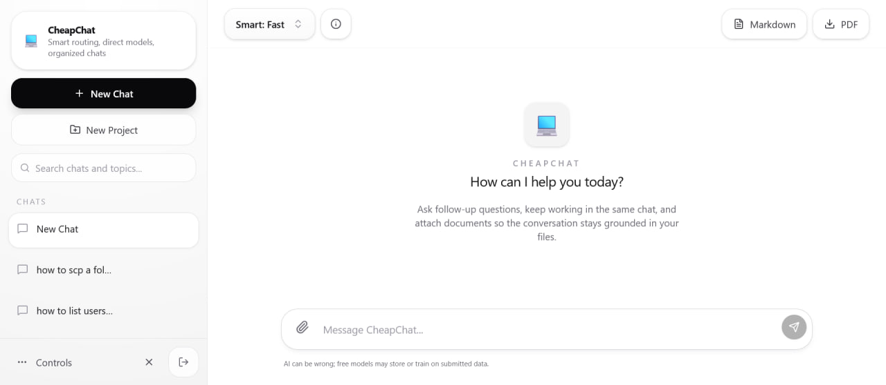
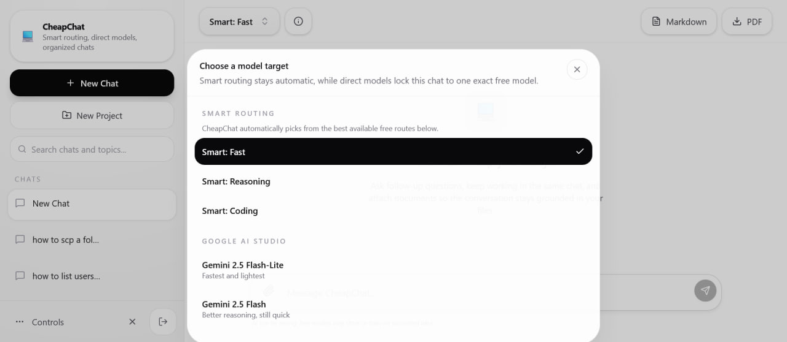

# CheapChat

CheapChat is a web app built to help you use free-tier and low-cost AI resources without being forced into a monthly subscription.

The practical idea is simple: when one provider hits limits, pricing gets annoying, or a free quota resets later, you can switch APIs, rotate providers, and keep using the app instead of being locked into one paid product.

## Recommended stack
For most people, the best setup is:
- **Vercel** for hosting
- **Neon** for the database

If you do not want to use Vercel, then **Netlify + Neon** is the main alternative.

## Who this is for
CheapChat is a good fit if you want:
- a private personal AI chat space
- model and provider choice instead of being locked into one subscription
- low recurring cost
- a lightweight self-hosted setup
- chat history stored in your own database
- file upload support for documents and extracted text workflows
- a project you can tweak for your own needs

CheapChat is primarily designed as a **single-user web app**.

That means the current shape of the project is optimized for one person or one private deployment, not a fully featured multi-user SaaS. It can absolutely be extended later, but that is not the main design target right now.

## Core idea
Instead of depending on a single subscription AI product, CheapChat lets you combine:
- free-tier or low-cost model APIs
- easy provider switching when limits reset or usage changes
- your own deployment and storage
- a UI focused on practicality instead of product lock-in

The result is a chat app that helps you keep using available AI resources without getting stuck waiting on one provider or paying for a subscription you do not want.

## Main features
- personal web chat UI
- persistent chat history
- session-based access with a shared app password
- provider configuration stored in the app
- encrypted provider settings in the database
- support for multiple LLM providers
- routing across different providers and models
- file upload support
- text extraction from uploaded files
- low-cost deployment options

## Screenshots
### Main chat view


Shows the default CheapChat interface with the sidebar, chat list, current model target selector, and the main input area.

### Smart routing and model modes


Shows the automatic routing modes and direct model targets available in the app.

Smart routing modes shown here:
- **Smart: Fast**
  - prioritizes speed and quick responses
- **Smart: Reasoning**
  - prioritizes stronger reasoning and harder multi-step tasks
- **Smart: Coding**
  - prioritizes code-oriented and technical models when available

The code currently defines these selectable direct models across providers:
- **Gemini 2.5 Flash-Lite** *(Google AI Studio)*
- **Gemini 2.5 Flash** *(Google AI Studio)*
- **Llama 3.1 8B Instant** *(Groq)*
- **Llama 3.3 70B Versatile** *(Groq)*
- **DeepSeek R1 Distill Llama 70B** *(Groq)*
- **Llama 3.1 8B** *(Cerebras)*
- **Llama 3.3 70B** *(Cerebras)*
- **Mistral Small** *(Mistral)*
- **Mistral Large** *(Mistral)*
- **Llama 3.3 70B Instruct** *(OpenRouter)*
- **Qwen 3 Coder** *(OpenRouter)*
- **Gemma 3 27B Instruct** *(OpenRouter)*

## Supported stack
### App framework
- Next.js
- React
- Tailwind CSS

### Database
- Neon Postgres
- Prisma

### AI providers
The codebase is set up to work with multiple providers and routing logic, including support for setups based on:
- OpenRouter
- Groq
- Google
- Cerebras
- Mistral

The exact providers you use are up to you and your budget.

### Files and uploads
- UploadThing for file uploads
- text extraction support for several document types

## How the cost stays low
CheapChat is designed so you can avoid paying for a fixed monthly AI subscription if you do not need one.

Typical low-cost approach:
- host the app on **Vercel** or **Netlify**
- use **Neon** for the database
- add only the provider keys you actually want
- prefer providers with free tiers or cheaper token pricing
- use the app as a personal assistant/chat workspace rather than a public multi-user service

This makes the project especially useful for people who want personality, persistence, and nice features without paying a premium flat subscription every month.

## Architecture at a glance
- the frontend is a Next.js app
- chats, messages, and app config are stored in Postgres
- provider/API settings are stored in the database
- sensitive provider config is encrypted using `APP_CONFIG_MASTER_KEY`
- user access is gated by a shared `APP_PASSWORD`
- session cookies are signed with `SESSION_SECRET`

## Environment variables
CheapChat needs the following environment variables:

- `DATABASE_URL`
  - your Postgres connection string, typically from Neon
  - the app uses this to store chats, messages, attachments metadata, and app configuration
- `SESSION_SECRET`
  - secret used to sign the session cookie
  - this is what keeps login sessions valid and prevents easy cookie forgery
- `APP_CONFIG_MASTER_KEY`
  - encryption key used to protect sensitive provider settings stored in the database
  - this matters because API keys saved through the UI should not sit in plaintext in the database
- `APP_PASSWORD`
  - the shared password used to enter the app
  - since this project is built mainly for single-user or private use, this acts as the simple app gate

The included `.env.example` shows the expected variables.

## How settings are stored
CheapChat stores most long-lived app data in the database, including things like:
- chats
- messages
- attachment metadata
- app configuration

Provider settings can be saved through the UI. Those settings are stored in the database so they persist across deploys and restarts.

Sensitive provider values are encrypted before they are stored. That is why `APP_CONFIG_MASTER_KEY` exists.

In simple terms:
- the database stores the encrypted value
- the app uses `APP_CONFIG_MASTER_KEY` to decrypt it when needed
- this is safer than storing provider secrets in plaintext inside the database

That does **not** make the app magically secure, but it is still much better than leaving raw API keys exposed in database rows.

## Setup tutorial
### 1. Create the required accounts
Start with these:
- **Vercel**: https://vercel.com/
- **Neon**: https://console.neon.tech/

Optional or additional services:
- **Netlify**: https://app.netlify.com/
- **OpenRouter**: https://openrouter.ai/
- **Groq**: https://console.groq.com/keys
- **Google AI Studio / Gemini**: https://aistudio.google.com/app/apikey
- **Cerebras**: https://inference.cerebras.ai/
- **Mistral**: https://console.mistral.ai/
- **UploadThing**: https://uploadthing.com/dashboard

### 2. Clone the repository
```bash
git clone <your-repo-url>
cd CheapChat
```

### 3. Install dependencies
```bash
npm install
```

### 4. Create your environment file
```bash
cp .env.example .env
```

Fill in:
- `DATABASE_URL`
- `SESSION_SECRET`
- `APP_CONFIG_MASTER_KEY`
- `APP_PASSWORD`

### 5. Create the Neon database
- create a project in Neon
- create a database
- copy the connection string
- paste it into `DATABASE_URL`

### 6. Generate Prisma client and push the schema
```bash
npx prisma generate
npx prisma db push
```

### 7. Start the app locally
```bash
npm run dev
```

Then open `http://localhost:3000`.

### 8. Log in and configure providers
After the app boots:
1. log in with `APP_PASSWORD`
2. open the settings UI
3. add the provider API keys you want to use
4. save them in the app
5. start chatting and adjust models/providers to your preference

## Where to create the services and API keys
If you want to reproduce the low-cost or free-friendly setup, these are the main services to create accounts for.

### Core infrastructure
- **Vercel (recommended hosting)**: https://vercel.com/
  - Recommended default for this project if you want the smoothest Next.js deployment experience.
- **Neon (recommended database)**: https://console.neon.tech/
  - Recommended database choice. Create a Postgres database and copy the connection string into `DATABASE_URL`.
- **Netlify (alternative hosting)**: https://app.netlify.com/
  - Reasonable alternative if you prefer Netlify instead of Vercel.

### Model providers
- **OpenRouter**: https://openrouter.ai/
  - Useful if you want access to multiple models through one API.
- **Groq API keys**: https://console.groq.com/keys
  - Often a good option for low-cost or free fast inference.
- **Google AI Studio / Gemini API key**: https://aistudio.google.com/app/apikey
  - Create a Gemini API key for Google models.
- **Cerebras Inference**: https://inference.cerebras.ai/
  - Create an account and get an API key if you want to use Cerebras-supported models.
- **Mistral Console**: https://console.mistral.ai/
  - Create an account and generate an API key for Mistral models.

### File uploads
- **UploadThing dashboard**: https://uploadthing.com/dashboard
  - Create a project and get the UploadThing token if you want uploads enabled.

## Practical provider advice
- Start with one provider first, not all of them.
- OpenRouter is the easiest all-around starting point for most people.
- Groq is worth trying when you want fast responses and the available models fit your use case.
- Google is worth adding if Gemini pricing or free-tier access works for you.
- Add UploadThing only if you actually want file upload support.

## Recommended deployment setup
If you want the simplest path, I recommend:
- **Vercel** for hosting
- **Neon** for the database

That is the most natural setup for this project.

If you do not want to use Vercel, then:
- **Netlify + Neon** is the main alternative

## Deployment
## Vercel
CheapChat can be deployed as a standard Next.js app on Vercel.

You need to set these environment variables in the Vercel dashboard:
- `DATABASE_URL`
- `SESSION_SECRET`
- `APP_CONFIG_MASTER_KEY`
- `APP_PASSWORD`

General flow:
1. push the repo to GitHub
2. import it into Vercel
3. set the environment variables
4. deploy
5. run `prisma db push` as needed against your Neon database

## Netlify
CheapChat also includes Netlify configuration.

Required environment variables are the same:
- `DATABASE_URL`
- `SESSION_SECRET`
- `APP_CONFIG_MASTER_KEY`
- `APP_PASSWORD`

See `docs/netlify-deploy.md` for the current Netlify notes.

## Security model
CheapChat uses a deliberately simple security model because it is intended for personal/private use:
- one shared app password to enter
- signed session cookies
- encrypted provider settings stored in the database

That is acceptable for a personal deployment, but it is not the same as a hardened multi-user auth system.

## Free is not truly free
Free is often not really free. In many cases, **you are the product**.

Providers may monetize your usage through:
- data collection
- ecosystem lock-in
- usage analytics
- future upsells
- training or product improvement pipelines

That means you should be careful about what you send to any third-party AI provider.

Do **not** assume a free service is private.
Do **not** assume your prompts or uploaded files will never be retained.
Do **not** send sensitive personal, financial, legal, medical, or confidential work information unless you understand the provider's policy and are comfortable with the risk.

## Publishing and safety notes
Before publishing or sharing the repository:
- do **not** commit a real `.env`
- rotate any secrets that were previously stored in `.env`
- do not commit build artifacts like `.next/`
- do not commit dependency folders like `node_modules/`
- do not commit local hosting metadata such as `.vercel/`

## Project boundaries
CheapChat is a strong fit for:
- personal use
- hobby self-hosting
- low-cost AI experimentation
- custom private chat setups

CheapChat is not positioned for:
- enterprise teams
- strict compliance environments
- large-scale multi-user deployments
- advanced auth and permission systems

## Repository hygiene checklist
A clean repo for this project should contain:
- source code
- docs
- Prisma schema
- deployment config
- `.env.example`

A clean repo should not contain:
- real secrets
- `node_modules/`
- `.next/`
- `.vercel/`
- temporary build outputs

## OpenClaw note
This repository was cleaned up and prepared for publication with help from OpenClaw, including documentation improvements, screenshot integration, removal of obvious embedded secrets from the prepared copy, and general repo cleanup.
